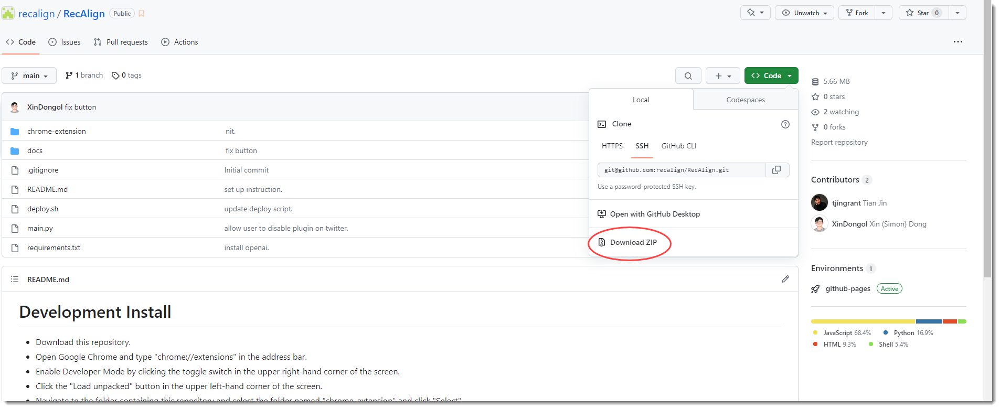
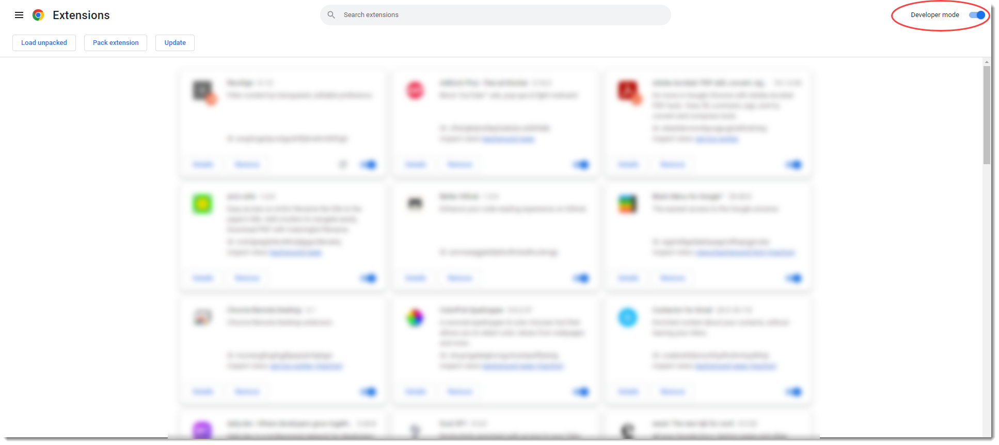
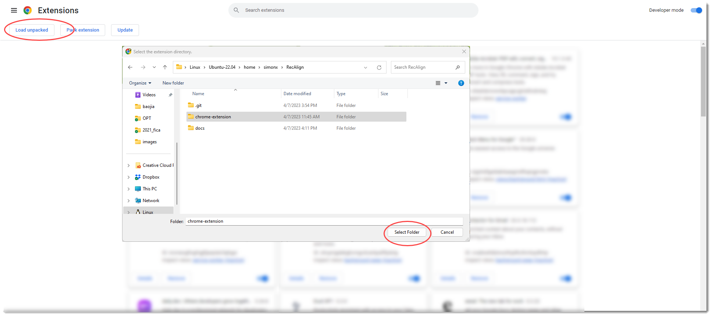
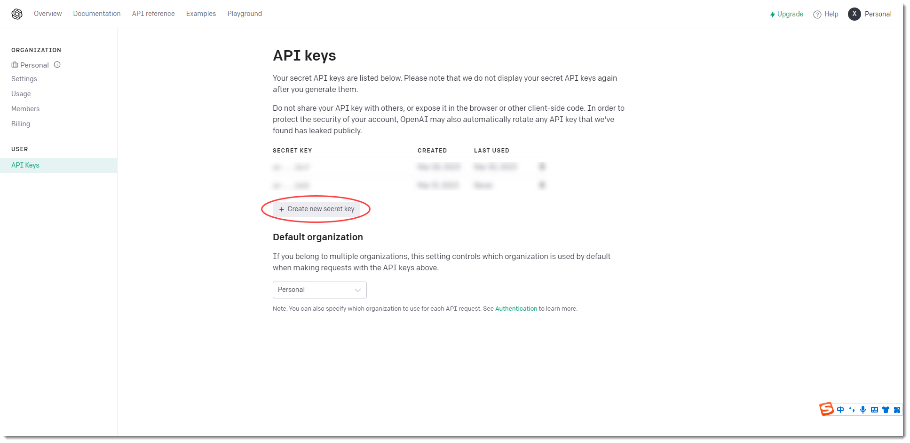
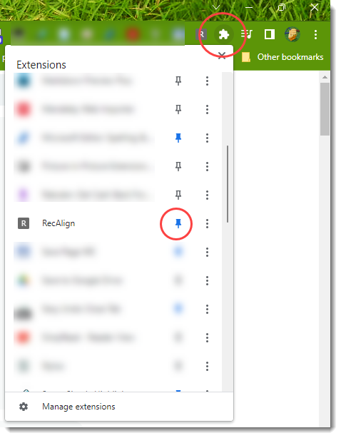

## Get Started

### 1. Download the repository 

Download the repository from [GitHub](https://github.com/recalign/RecAlign) and unzip it. 

Consider to give the project a Star if you like it.

### 2. Open Chrome extension page

In Chrome, open the extension page from the menu: `More tools` -> `Extensions` or enter `chrome://extensions/` in the address bar.

Open the developer mode in the top right corner.

### 3. Load the extension

Click `Load unpacked` and select the `chrome-extension` folder in the repository. Congrats! You have installed the extension.

### 4. Get your OpenAI API key

Go to [OpenAI](https://platform.openai.com/account/api-keys) and sign up for an account.

Create a new API key, copy and remember it. You will need it in the next step.

Disclaimer: we do not store your API key. It is only used to call OpenAI API. You are responsible for the cost of using OpenAI API. You can remove the key at any time if you do not want to use it anymore.

### 5. Configure the extension

Pin the extension to the toolbar. Click the extension icon, enter your OpenAI API key and your preferences in the popup window.

You are ready to go! Enjoy the extension.